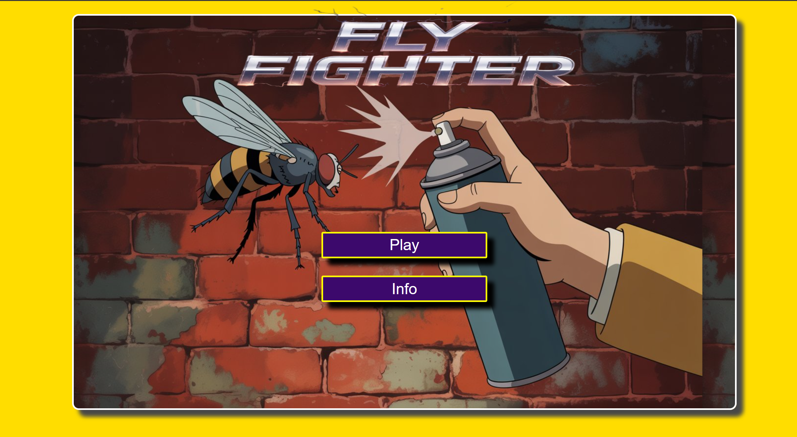
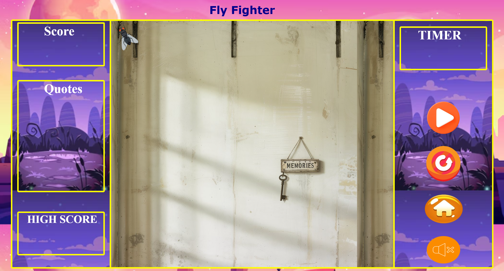

# Fly-Fighter

**Fly-Fighter** is a simple and engaging fly-swatting game developed using HTML, CSS, and JavaScript. The objective is to click on flies as they appear on the screen, testing your reflexes and hand-eye coordination.

## 🎮 Gameplay

* Flies appear randomly on the screen.
* Click on the flies to swat them.
* Each successful swat increases your score.
* The game continues until a certain condition is met (e.g., time limit or missed flies).

## 🚀 Features

* Interactive and responsive UI.
* Real-time score tracking.
* Sound effects for enhanced user experience.
* Lightweight and fast-loading.

## 🛠️ Technologies Used

* **HTML**: Structure of the game.
* **CSS**: Styling and animations.
* **JavaScript**: Game logic and interactivity.

## 📂 Project Structure

```
Fly-Fighter/
├── Audio/
│   └── [Audio files for game sounds]
├── Images/
│   └── [Image assets for flies, background, etc.]
├── flyfighter.html
├── flyfighter.css
├── index.html
├── index.css
├── info.html
├── second.js
└── README.md
```

## 🔧 Installation and Setup

1. **Clone the repository:**

   ```bash
   git clone https://github.com/sarthakdarade07/Fly-Fighter.git
   ```

2. **Navigate to the project directory:**

   ```bash
   cd Fly-Fighter
   ```

3. **Open `index.html` in your preferred web browser:**

   * You can double-click the file, or
   * Use a live server extension if you're using VS Code.

## 📸 Screenshots




## 🤝 Contributing

Contributions are welcome! If you'd like to improve the game or fix bugs:

1. Fork the repository.
2. Create a new branch:

   ```bash
   git checkout -b feature/YourFeature
   ```
3. Commit your changes:

   ```bash
   git commit -m "Add YourFeature"
   ```
4. Push to the branch:

   ```bash
   git push origin feature/YourFeature
   ```
5. Open a pull request.


## 📬 Contact

For any inquiries or feedback, please contact [sarthakdarade07](https://github.com/sarthakdarade07).

---


